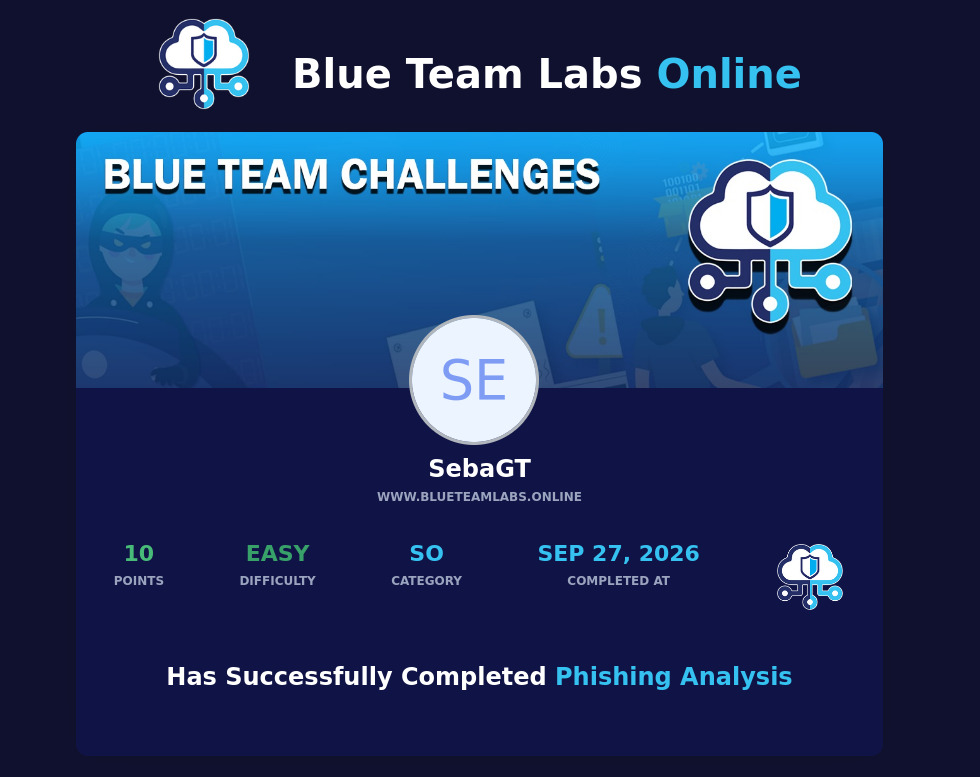

# Phishing Analysis - Blue Team Labs Online

## Introducción
Mi primer lab en BTLO. Me tocó revisar un correo de rebote que venía de un formulario de contacto abusado para hacer spam.

## Herramientas que usé
- Mousepad para abrir el .eml
- URLScan.io / URL2PNG para ver la URL sin entrar

## Qué hice

**1. Revisé el correo (.eml)**
Abrí el archivo y busqué la cabecera `X-Originating-IP` para sacar la IP real del que mandó el spam. Después busqué `http` y encontré el link que venía dentro del formulario.

**2. Revisé el link**
Era un link de Blogspot. Lo metí en URL2PNG y salía el mensaje `Blog has been removed`, o sea que Google ya lo había dado de baja.

## IoCs que encontré
- IP origen: 103.9.171.10
- Dominio / URL: hxxps://35000usdperwwekpodf.blogspot[.]sg
- Hosting: Blogspot / Blogger
- Archivo adjunto: Website contact form submission.eml

## Veredicto
Phishing / Spam. Es un caso de backscatter, usan un formulario para que el rebote le llegue a otro.

## Qué aprendí
Aprendí a buscar la IP en Received y a no fiarme de la extensión, hay que revisar el contenido real y ser mas precavido.
