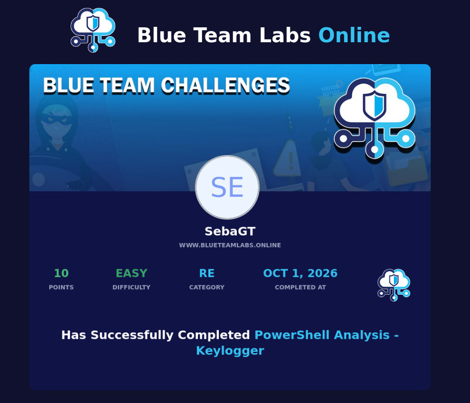

# PowerShell Analysis - Keylogger

## Introducción

Este laboratorio consistió en realizar un análisis estático de un script de PowerShell sospechoso para comprender su funcionamiento, identificar su comportamiento malicioso y extraer Indicadores de Compromiso (IoC) clave.

## Herramientas Utilizadas

* **Terminal de Kali Linux (Bash):** Utilizada para la gestión de archivos comprimidos (`unzip`) y cálculo de hashes criptográficos (`sha256sum`).
* **Editor de texto (Mousepad / Nano):** Utilizado para inspeccionar el contenido y el código fuente del script de PowerShell de manera segura.

## Paso a Paso del Análisis

1. **Extracción y Cálculo de Hash:** Se procedió a descomprimir el archivo protegido utilizando la contraseña provista por la plataforma. Posteriormente, mediante el uso de la terminal, se calculó el hash SHA256 del script malicioso para su correcta identificación e integridad.

2. **Inspección del Script y Extracción de IoCs:** Se analizó el código fuente del script para identificar las tácticas y artefactos de Windows utilizados:
   * **Credenciales y Configuración de Red:** Se localizaron las credenciales configuradas para el envío de información y el puerto SMTP utilizado para la exfiltración de datos.
   * **APIs de Windows:** Se identificaron las librerías dinámicas (`DLL`) importadas por el script para llevar a cabo el registro de pulsaciones de teclas (*keylogging*).
   * **Rutas de Archivos:** Se determinó el directorio de destino donde el script almacena el archivo de texto generado con la información capturada.

## Conclusión y Aprendizajes

Este laboratorio me permitió practicar el flujo de trabajo para desenterrar información sensible dentro de scripts maliciosos de PowerShell. Aprendí a manejar archivos comprimidos protegidos desde la terminal, calcular hashes de verificación y extraer Indicadores de Compromiso (IoC) fundamentales para una investigación defensiva.

Este write-up forma parte de mi portafolio continuo de aprendizaje en ciberseguridad defensiva (Blue Team).
